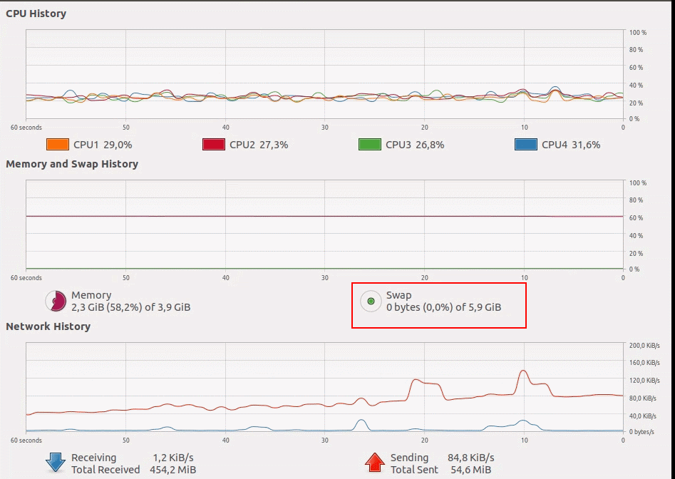

# EdgeDeviceSetup
Instructions and Manuals on how to set up Nvidia edge device<br>

Instructions below can be applied mainly to Jetson Nano device for Development and Testing<br>

## 0. Pre-installation tips

1. Install 32Gb (or bigger) SD card if possbile

## 1. OS installation
Current version is r32.4.2 (5/16/2020)

1. Follow [this](https://developer.nvidia.com/embedded/learn/get-started-jetson-nano-devkit#write) instruction to download and flash sd card.

## 2. First boot

1. On the first boot when you'd be asked to set up 'APP folder' size select maximum available value

## 3. System tuning

1. By default system has factory settings (low ram and buffer) which might result in hanging and crashes of resource-greedy programs (like Neural network inference). To fix this issue extend system swap file. Current swap file size can be checked here:
<p align="center">
  
</p>
* To extend swap file download and unpack this [repository](https://github.com/JetsonHacksNano/resizeSwapMemory)<br>
* Execute:

```sh
./setSwapMemorySize -g 4
```

* (Optional) Size of zram can be modified, see links in resizeSwapMemory repo<br>

## 4. Remote access

1. To access Edge device in Remote Desktop mode install 'NoMachne for arm' ([link](https://www.nomachine.com/download/linux&id=30&s=ARM)) on Edge device and 'NoMachine Desktop' on your computer. Software works only in local network, in order to access device in other network VPN has to be setup.
2. (Optional) OpenVPN installation.<br>
Go to OpenVPN website to check the latest versions of commands. But basically you would need OpenVPN server with public IP, from this server you have to create a new connection (.ovpn file) with certificaties and keys. Move .ovpn on the Edge device and execute command below:
```sh
sudo apt-get install openvpn //To install openvpn on edge device
sudo openvpn --config jetsonHome.ovpn //To run open vpn on edge device
```
if OpenVPN was installed, NoMachine connection can be established via IP-address assigned by OpenVPN network.
3. (Optional) AutoSSH conection can be established. Approach is similar to OpenVPN.

## 5. Software installation

1. **jtop** - tool similar to System Monitor, **jetson_release** - tool to display all installed libraries and their versions (helpful when you need to know Jetpack, cuDNN and CUDA versions). Both tools can be donwloaded from [here](https://github.com/rbonghi/jetson_stats). Installation:
```sh
sudo -H pip install -U jetson-stats
*Reboot device*
```
Usage:
```sh
jtop
jetson_release
```

2. **VSCode** - IDE for developement. Follow this [tutorial](https://www.jetsonhacks.com/2019/10/01/jetson-nano-visual-studio-code-python/). Use following commands to isntall:
```sh
$ git clone https://github.com/JetsonHacksNano/installVSCode.git
$ cd installVSCode
$ ./installVSCode.sh
```
To run:
```sh
$ code-oss
```

3. (Optional) **Tensorflow**. Check the [instruction](https://docs.nvidia.com/deeplearning/frameworks/install-tf-jetson-platform/index.html). For Jetpack 4.4 Tensorflow v1.X.X installation command looks like:
```sh
sudo pip3 install --pre --extra-index-url https://developer.download.nvidia.com/compute/redist/jp/v44 ‘tensorflow<2’
```

4. (Optional) **Scikitlearn**. Install via pip, if you'd face issues, please refer [this thread](https://stackoverflow.com/questions/60448903/cannot-install-scikit-learn-on-jetson-nano)

## 6. Deepstream 4.0

[Link](https://github.com/ReconAI/EdgeDeviceSetup/tree/master/deepstream40)

## 7. Deepstream 5.0

[Link](https://github.com/ReconAI/EdgeDeviceSetup/tree/master/deepstream50)